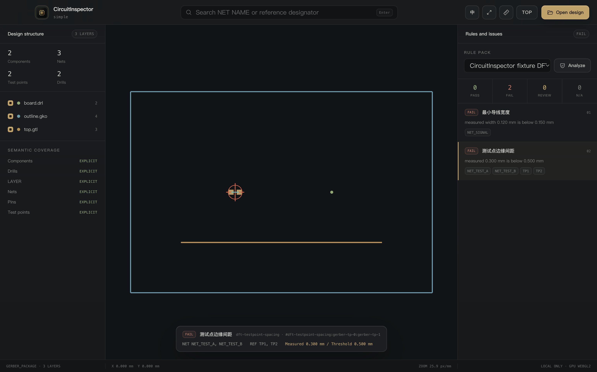
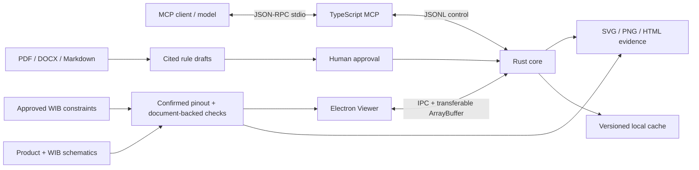

<div align="center">


# CircuitInspector

### Local PCB manufacturing-data inspection with explicit semantic confidence.

**A Rust-native ODB++ and Gerber analysis engine, auditable DFT/DFM rules, a GPU vector viewer, and a local stdio MCP.**

<p>
  
  
  
  
</p>

<p>
  
  
  
  
</p>

[Overview](#01--system-overview) · [Quick start](#02--quick-start) · [Format support](#03--manufacturing-data-and-semantics) · [MCP](#05--mcp-surface) · [Architecture](#07--architecture) · [Validation](#08--validation-and-performance)

</div>

---

<p align="center">
  
</p>

<p align="center"><sub>Current macOS arm64 Viewer rendering a local Gerber fixture and its selected test-point spacing violation.</sub></p>

<div align="center">

**Local-first** · **Geometry-native** · **Evidence-linked** · **Explicit confidence**

</div>

---

## 01 / System overview

CircuitInspector turns PCB manufacturing output into reviewable engineering evidence. The Rust core owns parsing, normalized geometry, semantic coverage, spatial queries, rule evaluation, caching, and deterministic evidence rendering. The TypeScript MCP exposes that capability to models without moving design data to a remote service. The Electron application provides a single-canvas, GPU-accelerated inspection surface for engineers.

<table>
<tr>
<td width="50%" valign="top">

### Native geometry pipeline

- Safe ingestion for directories, ZIP, TGZ, and TAR.GZ packages
- Integer-nanometre coordinates with source transform evidence
- Viewport-aware binary tiles and level-of-detail selection
- Rust-rendered SVG and up-to-4096 × 4096 PNG evidence

</td>
<td width="50%" valign="top">

### Semantic integrity

- `EXPLICIT`, `SUPPLEMENTED`, `INFERRED`, and `MISSING` coverage
- No guessed NET, component, pin, or test-point failure verdicts
- Candidate rules remain drafts until a human approves an immutable version
- Conflict and missing-data states remain visible in every result

</td>
</tr>
</table>

<table>
<tr>
<td width="33%" valign="top">

#### 01 · Manufacturing data

ODB++ products and archives, Gerber X1/X2/X3 packages, Gerber Job, XNC/Excellon, and optional IPC-356.

</td>
<td width="33%" valign="top">

#### 02 · DFT and DFM rules

Test-point spacing and clearance, accessibility, trace geometry, copper/edge clearance, hole-to-copper, annular ring, and drill/slot spacing.

</td>
<td width="33%" valign="top">

#### 03 · Model integration

Twelve structured MCP tools, progress and cancellation, paginated findings, evidence resources, and stdout reserved for JSON-RPC.

</td>
</tr>
<tr>
<td width="33%" valign="top">

#### 04 · GPU viewer

One WebGL2 canvas with pan, zoom, fit, layer controls, object picking, measurement, search, issue navigation, front/back inspection, and a persistent Chinese/English interface switch.

</td>
<td width="33%" valign="top">

#### 05 · Deterministic evidence

The core renders annotated issue geometry, distance lines, thresholds, NET names, reference designators, and stable issue IDs.

</td>
<td width="33%" valign="top">

#### 06 · Local trust boundary

Designs, rule documents, indexes, caches, reports, and evidence remain local by default. The model receives only requested summaries and evidence.

</td>
</tr>
</table>

> [!IMPORTANT]
> This repository is the **V1 engineering baseline (0.1.0)**, not an ODB++ or Gerber certified implementation. The bundled gold fixtures pass, but the official Ucamco suite, the 2 GB / 20-million-primitive performance gate, and Windows x64 hardware acceptance are still `NOT_RUN`.

## 02 / Quick start

### Requirements

- Rust stable toolchain
- Node.js 22 or newer
- npm 10 or newer
- A WebGL2-capable GPU for the Viewer

Install dependencies and validate the workspace:

```bash
npm install
npm run typecheck
npm test
npm run build
```

Start the Viewer in development mode:

```bash
npm run dev:viewer
CIRCUIT_INSPECTOR_VIEWER_DEV_URL=http://127.0.0.1:5173 \
  npm run start -w @circuit-inspector/viewer
```

Start the local MCP after building the Rust core:

```bash
npm run build:core
CIRCUIT_INSPECTOR_CORE="$PWD/target/release/circuit-inspector-core" \
  npm run start:mcp
```

Packaged MCP client configuration:

```json
{
  "mcpServers": {
    "circuit-inspector": {
      "command": "/absolute/path/to/CircuitInspector-MCP-macOS-arm64-0.1.0/circuit-inspector-mcp"
    }
  }
}
```

> [!NOTE]
> `extract_rule_pack` always produces a `DRAFT`. Open the Viewer and verify the object type, scope, distance definition, comparator, threshold, unit, filters, severity, and source citation before approving it for analysis.

## 03 / Manufacturing data and semantics

| Input | V1 parsing path | Semantic behavior |
|---|---|---|
| ODB++ directory, `.tgz`, `.tar.gz` | Job, step/panel, matrix, profile, layers, features, components, packages, pins, nets, drill/route, transforms, and step-repeat paths | Source-backed relationships are `EXPLICIT`; absent or partial source data is never silently reconstructed |
| Gerber X2/X3 + drill | Graphics, attributes, component layers, apertures/macros, regions, arcs, polarity, and step-repeat paths | Attributes provide explicit semantics where present |
| Gerber + IPC-356 | Geometry plus netlist relationships | Added relationships are `SUPPLEMENTED`; disagreements produce `DATA_CONFLICT` |
| Gerber X1 | Accurate graphic and basic DFM path | NET/component/test-point rules become `REVIEW` or `NOT_APPLICABLE` when semantics are unavailable |
| Gerber Job `.gbrjob` | File inventory and layer-function metadata | Only declared metadata is added |
| XNC / Excellon | Drill and slot data | Drill semantics are preserved with their source evidence |

Every imported design returns a `SemanticCoverage` record for layers, nets, components, pins, test points, and drills. The rule engine uses those states as part of adjudication: `MISSING` inputs cannot produce a false FAIL, and heuristic test points remain `REVIEW` until confirmed.

See [format support and conformance boundaries](docs/format-support.md).

## 04 / Rules and analysis

Local PDF, DOCX, and Markdown specifications can be indexed with page, paragraph, source-text hash, and excerpt provenance. Retrieval or a Skill may propose candidate rules, but only an approved immutable rule-pack version is executable.

V1 contains rule paths for:

- Test point to test point, component, board edge, and keep-out clearance
- Test-point accessibility
- Minimum trace width and copper spacing
- Copper to board-edge and hole-to-copper clearance
- Annular ring width
- Drill and slot spacing

Results are deliberately broader than PASS/FAIL:

| Status | Meaning |
|---|---|
| `PASS` | The required semantics are available and the measured geometry satisfies the approved rule |
| `FAIL` | The required semantics are available and the measured geometry violates the approved rule |
| `REVIEW` | A human decision is required, commonly because identification is heuristic or data conflicts |
| `NOT_APPLICABLE` | The rule cannot be evaluated for the imported data without inventing missing semantics |

## 05 / MCP surface

| Tool | Purpose |
|---|---|
| `import_design` | Detect and stream-import an ODB++ or Gerber manufacturing package; return semantic coverage and diagnostics |
| `import_schematic` | Import product or WIB connector/pin/NET NAME evidence from JSON, CSV/TSV, text, or text-bearing PDF |
| `confirm_schematic_pinout` | Confirm or correct the complete pinout and optional structured WIB design metrics before formal comparison |
| `compare_fixture_wiring` | Compare confirmed product and WIB pins one-to-one, report swaps/missing/extra pins, and return PASS only for a clean confirmed scope |
| `recommend_manufacturing_tests` | Generate manufacturing-line test advice, corresponding WIB design guidance, and a hard-constraint/TBD matrix |
| `create_wib_constraint_set` | Store explicit approved WIB requirements with comparator, value/range, unit, authority, revision, and approver |
| `qualify_wib_design` | Close the loop across product schematic, actual WIB schematic/design metrics, and an approved constraint set |
| `extract_rule_pack` | Extract cited candidate rules from a local PDF, DOCX, or Markdown specification |
| `list_rule_packs` | List draft, approved, and immutable rule-pack versions |
| `analyze_design` | Evaluate an imported design using an approved rule pack |
| `query_violations` | Page and filter results by NET, reference, layer, rule, severity, and status |
| `render_evidence` | Generate local SVG or high-resolution PNG evidence for an issue or selected region |

Resources expose analysis summaries, individual findings, evidence files, and full reports. A violation includes source format, semantic confidence, NET name, reference designator, layer, coordinates, measured value, threshold, rule citation, and an evidence URI.

Schematic PDF extraction produces candidates, not an automatic electrical truth source. Product and WIB pinouts must be explicitly confirmed before a mismatch can become formal `FAIL` or a clean comparison can become `PASS`. Closed-loop WIB qualification returns `PASS` only when all applicable constraints in the approved set have supported actual evidence and pass; missing metrics, unit conflicts, or factory-dependent evidence remain `REVIEW`.

The MCP never opens the Viewer on its own. A client can present a result link; the user chooses whether to open the independent Viewer window focused on that analysis and issue.

## 06 / Viewer and evidence

The renderer does not create a DOM or SVG node for each PCB primitive. Rust returns compact binary viewport tiles through transferable `ArrayBuffer` messages. The Viewer retains the current and adjacent GPU tiles, prefetches around a pan, switches LOD during zoom, and redraws vector geometry at every scale.

Implemented interaction paths include:

- Chinese and English UI, selected from the system language on first run and switchable at any time
- Drag-to-pan, wheel zoom, box selection, fit-to-board, and front/back view
- Layer tree, NET/reference search, object picking, and measurement
- Issue list, next/previous navigation, and one-click focus
- Violation outlines, distance lines, thresholds, NET names, references, and issue IDs
- Product-to-WIB pin-line annotations for matches, swaps, missing pins, and unconfirmed rows
- Manufacturing-test recommendations, WIB design guidance, hard-constraint matrices, and final qualification results opened by analysis deep link
- Gerber dark/clear polarity, macro, region, drill, and layer-stack rendering paths

Evidence images are generated by the Rust geometry renderer rather than captured from the screen, keeping output deterministic across display scale and operating system.

## 07 / Architecture



The Rust core is the sole authority for manufacturing data, geometry, and geometry verdicts. The TypeScript MCP owns the separate document-backed schematic workflow and never re-computes core geometry. The renderer does not parse source files or run full spatial queries on its main thread.

Read the [architecture](docs/architecture.md) and [security model](docs/security.md) for the complete boundaries.

## 08 / Validation and performance

### Validated in the current workspace

- 15 Rust tests passing; the Ucamco conformance test is present and explicitly ignored without external fixtures
- 14 TypeScript integration, schematic/WIB, qualification, and localization tests passing
- TypeScript typecheck and production builds passing
- Packaged macOS arm64 Viewer launched against the real Rust core
- SVG, PNG, HTML report, binary tile, package manifest, SBOM, and third-party notice generation exercised locally

### Required before a formal V1 claim

- Ucamco official PEG and X1/X2/X3, Job, and XNC suites
- Customer-provided or anonymized ODB++ and Gerber PASS/FAIL/REVIEW gold data
- Apple M1 / 16 GB and Windows 8-core / 16 GB / DX11-class integrated GPU acceptance
- 4K interaction P95 ≤ 16.7 ms and focus/search ≤ 100 ms
- 2 GB archive / 20-million-primitive cold view ≤ 10 s, warm reopen ≤ 2 s
- Full DFT + base DFM P95 ≤ 30 s and peak RSS ≤ 8 GB without swap reliance

Generate the synthetic 20-million-flash workload and measure cold/warm import:

```bash
npm run benchmark:generate -- 20000000 benchmarks/generated-20m
npm run build:core
npm run benchmark:import -- benchmarks/generated-20m benchmarks/cache
npm run benchmark:import -- benchmarks/generated-20m benchmarks/cache
```

> [!WARNING]
> The current JSON unified model and cache are suitable for functional validation, but they have not demonstrated the 20-million-primitive gate. Performance results must include stage timing, throughput, cache hits, memory, hardware, and fixture hash; an unexecuted gate remains `NOT_RUN`.

See the [performance acceptance contract](docs/performance.md).

## 09 / Packaging

Build on the target operating system; cross-building does not count as hardware acceptance:

```bash
npm run package:mac  # macOS arm64
npm run package:win  # Windows x64
```

Engineering packages include platform/CPU-specific Viewer and MCP archives, a pinned Node runtime for the MCP, an SPDX 2.3 SBOM, third-party notices, and `SHA256SUMS`. Generated packages live under `release/` and are intentionally excluded from Git.

Apple notarization, Developer ID signing, and Windows Authenticode are not promised by this baseline.

## 10 / Trust and security

- Local files remain local unless the user explicitly exports or shares an artifact
- Archive ingestion rejects traversal, escaping links, oversized entries, decompression bombs, and resource-limit violations
- Cache keys include source content and parser version so incompatible cache data is invalidated
- The Electron renderer uses context isolation and receives bounded local IPC APIs
- MCP stdout is reserved for JSON-RPC; diagnostics go to stderr
- Rule citations and evidence URIs retain the exact analysis, issue, and source relationship

## Documentation

- [Architecture](docs/architecture.md)
- [Format support](docs/format-support.md)
- [Performance acceptance](docs/performance.md)
- [Security model](docs/security.md)
- [Rule examples](docs/rules)

## License

CircuitInspector is licensed under the [MIT License](LICENSE).
