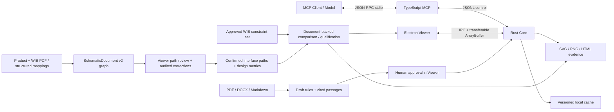

# 架构

Rust core 是制造数据、几何与几何裁决的唯一权威。TypeScript MCP 不重新计算距离；它独立负责原理图 pinout、WIB 接线、制造测试建议和已批准硬约束的文档型分析。Viewer renderer 不读取源文件、不解析 PCB，也不执行全量空间查询。

## 数据路径

1. 归档先经过条目数、展开体积、单文件体积、路径穿越与链接逃逸检查。
2. 解析器把坐标规范化为整数纳米，输出统一 `Design` 和每类语义覆盖。
3. core 按输入内容哈希缓存设计；视口请求写入 `CITL` 二进制 tile，renderer 直接用 `ArrayBuffer` 解码为 GPU 顶点。
4. 规则包只有 `APPROVED` 且带审批内容哈希时才可运行。规则所需的任一对象语义为 `MISSING` 时结果为 `NOT_APPLICABLE`，为 `INFERRED` 时结果为 `REVIEW`。
5. 证据由 core 的确定性几何渲染器输出，模型和 Viewer 引用同一分析 ID 与问题 ID。
6. 原理图 PDF 按页渲染并构建候选图：矢量页读取 PDF 文字/绘图操作，扫描页使用随包分发的本地 OCR 与图像处理资源。页面、元件、引脚、网络、导线、连接点、标签和路径均保留 `page + bbox + extraction_method + confidence`。
7. Viewer 先确认产品/WIB 接口锚点，再追踪 `接口引脚 → 网络 → 允许穿越器件 → 芯片引脚`。交叉线只有检测到连接点才连通；多端点、未知转换器、未解析跨页或总线关系保持 `REVIEW`。
8. 校正记录 before/after、操作人、时间和 SHA-256；校正会使旧确认失效。确认范围只包含用户选中的路径，不会把整份 PDF 标为权威网表。
9. 最终 WIB 合格判定读取两侧已确认路径、结构化 design metrics 和不可变的已批准 constraint set。任一相关路径或硬约束缺少支持证据时为 `REVIEW`；确认后的实际违规则为 `FAIL`；只有全部适用项通过才为 `PASS`。

## 关键边界

- WebGL2/ANGLE 是基线；WebGPU 未作为必需能力。
- PCB Viewer 保持单 WebGL2 Canvas。原理图审查器是独立的逐页 PDF Canvas/SVG 覆盖层；页面图像和覆盖数据只能通过受限 IPC 从对应 schematic artifact 缓存目录读取。
- 文档型分析呈现跨页路径、实际芯片端点、测试建议、WIB 设计建议、约束矩阵和最终裁决；它不会冒充 PCB 几何标注，也不会把自动端点解释为未经约束声明的功能意图。
- 当前 tile 是紧凑视口切片，但统一模型和持久化缓存仍为 JSON。2000 万图元门禁失败时，应把 `Design` 几何迁移到 mmap 友好的列式分块格式；MCP 协议和 Viewer tile 格式无需改变。
- Gerber clear polarity 已保留在 tile 中；当前 GPU 基线对 clear 图元使用背景擦除。多层透明合成的严格金标仍属于发布前兼容门禁。
