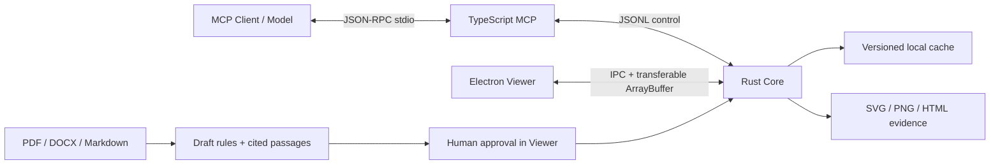

# 架构

Rust core 是制造数据、几何与裁决的唯一权威。TypeScript MCP 不重新计算距离；Viewer renderer 不读取文件、不解析 PCB，也不执行全量空间查询。MCP 与 Viewer 只通过本地子进程协议调用 core。

## 数据路径

1. 归档先经过条目数、展开体积、单文件体积、路径穿越与链接逃逸检查。
2. 解析器把坐标规范化为整数纳米，输出统一 `Design` 和每类语义覆盖。
3. core 按输入内容哈希缓存设计；视口请求写入 `CITL` 二进制 tile，renderer 直接用 `ArrayBuffer` 解码为 GPU 顶点。
4. 规则包只有 `APPROVED` 且带审批内容哈希时才可运行。规则所需的任一对象语义为 `MISSING` 时结果为 `NOT_APPLICABLE`，为 `INFERRED` 时结果为 `REVIEW`。
5. 证据由 core 的确定性几何渲染器输出，模型和 Viewer 引用同一分析 ID 与问题 ID。

## 关键边界

- WebGL2/ANGLE 是基线；WebGPU 未作为必需能力。
- Viewer 保持单 Canvas。DOM 只用于工具栏、图层树、规则和问题面板。
- 当前 tile 是紧凑视口切片，但统一模型和持久化缓存仍为 JSON。2000 万图元门禁失败时，应把 `Design` 几何迁移到 mmap 友好的列式分块格式；MCP 协议和 Viewer tile 格式无需改变。
- Gerber clear polarity 已保留在 tile 中；当前 GPU 基线对 clear 图元使用背景擦除。多层透明合成的严格金标仍属于发布前兼容门禁。
